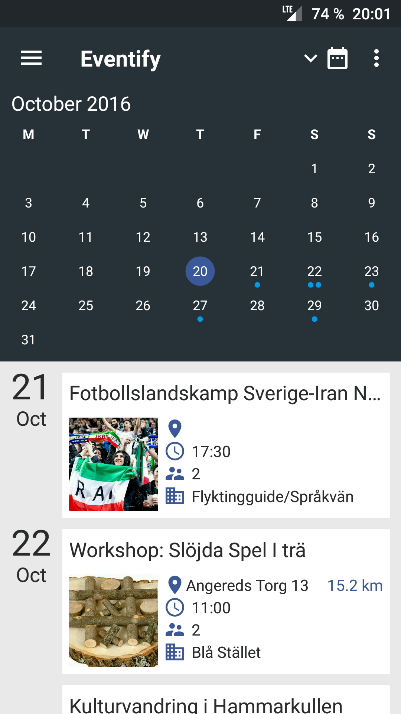

# Eventify

##Vision
Our vision with Eventify revolves around integrating refugees into the Swedish society and culture as well as improving their proficiency in the Swedish language. Eventify is built upon the idea that social events are a great way to achieve both of these goals. Eventify is an attempt to make an app of this category usable by everyone. By collecting relevant events from various sources the users can take part of what’s happening around them. Eventify eliminates the need of user accounts and minimizes the requirement of proficiency in the English and Swedish languages.

## Contributors
* Marcus Bertilsson
* Alex Sundbäck
* Johannes Mattsson
* Kristoffer Ek
* Long Nguyễn
* Oscar Hansson

##Screenhots

  
  
  

